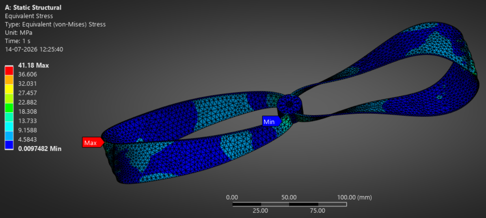
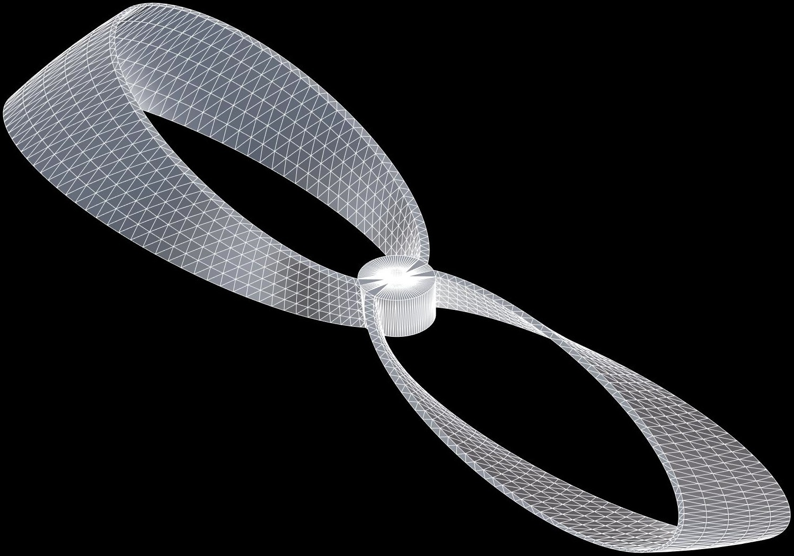
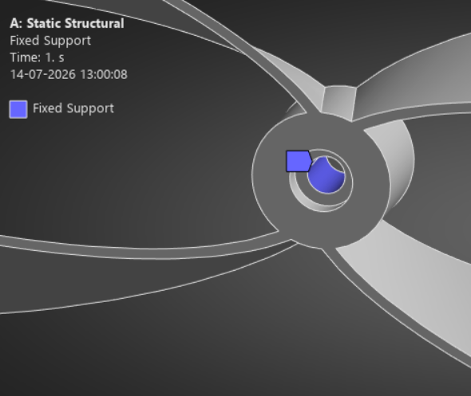
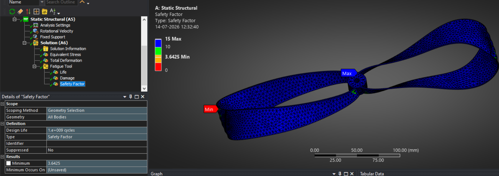
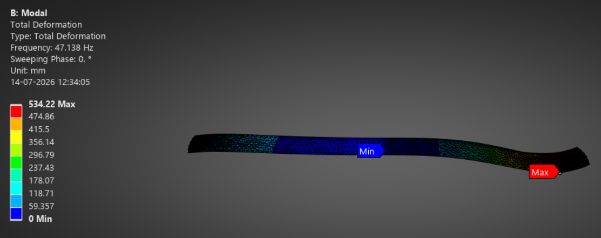
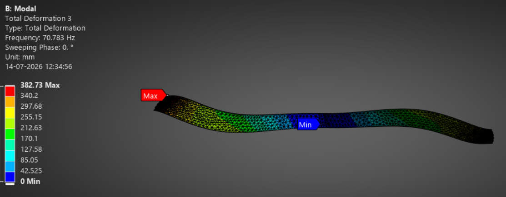
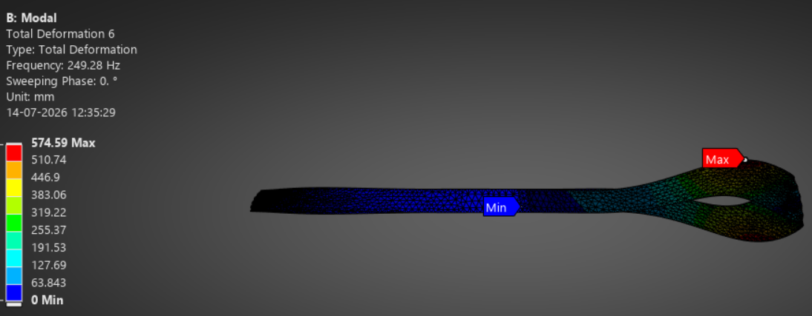

# Structural and Modal Analysis of a Toroidal Propeller

<p align="center">
  
</p>

<p align="center">
<em>Von Mises stress distribution of the toroidal propeller under operational rotational loading.</em>
</p>

## Overview

This repository contains the structural and modal analysis of a toroidal propeller geometry developed for nano drone applications. The analysis was performed as a continuation of an M.Tech research project focused on noise reduction in nano drones through toroidal propeller design.

The optimized toroidal propeller, developed during the M.Tech research project, achieved a **51% reduction in acoustic signature (63 dB to 31 dB)** with an **11% reduction in thrust** compared to the baseline propeller. This repository focuses on evaluating the structural integrity and dynamic behaviour of the final design under operational loading conditions.

---

## Geometry

<p align="center">
  
</p>

<p align="center">
<em>Final toroidal propeller geometry analysed in ANSYS Workbench.</em>
</p>

---

## Objectives

- Assess structural integrity of the toroidal propeller under operational rotational loading.
- Identify critical stress regions and evaluate safety margins.
- Determine natural frequencies and mode shapes to assess resonance risk under operating conditions.

---

## Software

- ANSYS Workbench 2024
  - Static Structural
  - Modal Analysis
- SpaceClaim

---

## Material Properties

**Carbon Fibre (290 GPa) — Orthotropic**

| Property | Value | Unit |
|----------|------:|------|
| Density | 1800 | kg/m³ |
| Young's Modulus (X) | 290 | GPa |
| Young's Modulus (Y, Z) | 23 | GPa |
| Poisson's Ratio (XY, XZ) | 0.2 | — |
| Poisson's Ratio (YZ) | 0.4 | — |
| Shear Modulus (XY, XZ) | 9 | GPa |
| Shear Modulus (YZ) | 8.21 | GPa |
| Tensile Ultimate Strength | 400 | MPa |

S–N curve defined using tabular data with log-log interpolation.

---

## Boundary Conditions

- **Fixed Support** applied at the hub where the propeller attaches to the motor shaft.
- **Rotational Velocity** of **262 rad/s (2500 RPM)** applied about the Y-axis to simulate centrifugal loading during operation.

<p align="center">
  
</p>

<p align="center">
<em>Boundary conditions used for structural and modal analysis.</em>
</p>

---

# Results

## Static Structural Analysis

### Von Mises Stress

<p align="center">
  
</p>

Maximum stress occurs near the blade root due to the highest bending moment generated by centrifugal loading. The maximum Von Mises stress is significantly below the material's ultimate tensile strength, indicating safe operation under the specified loading conditions.

---

### Total Deformation

<p align="center">
  
</p>

Maximum deformation occurs near the blade tip, which is expected for a cantilever-like structure subjected to rotational loading. The deformation remains within acceptable limits for normal operation.

---

### Safety Factor

<p align="center">
  
</p>

The minimum safety factor remains well above unity, confirming that the propeller possesses sufficient structural strength under the applied operating conditions.

---

### Summary

| Parameter | Value |
|-----------|------:|
| Maximum Von Mises Stress | 41.18 MPa |
| Maximum Total Deformation | 1.0801 mm |
| Minimum Safety Factor | 3.6425 |

The maximum Von Mises stress of **41.18 MPa** is well below the material's ultimate tensile strength of **400 MPa**, resulting in a minimum safety factor of **3.64** and confirming the structural feasibility of the toroidal propeller.

---

## Modal Analysis

The natural frequencies of the propeller were evaluated to determine the possibility of resonance during operation.

**Operating Frequency (2500 RPM): 41.67 Hz**

| Mode | Frequency (Hz) |
|------|---------------:|
| 1 | 47.138 |
| 2 | 47.223 |
| 3 | 70.396 |
| 4 | 47.138 |
| 5 | 247.53 |
| 6 | 249.28 |

---

### Mode 1

<p align="center">
  
</p>

---

### Mode 3

<p align="center">
  
</p>

---

### Mode 6

<p align="center">
  
</p>

The first natural frequency occurs at **47.14 Hz**, approximately **13% above the operating frequency**, reducing the likelihood of resonance during normal operation. Higher vibration modes occur at significantly higher frequencies and are therefore not expected to be excited during normal operating conditions.

---

## Key Findings

- Structural analysis confirms that the toroidal propeller can safely withstand operational centrifugal loading.
- Maximum Von Mises stress of **41.18 MPa** is well below the material's ultimate tensile strength, resulting in a minimum safety factor of **3.64**.
- The maximum total deformation of **1.08 mm** remains within acceptable limits for normal operation.
- The first natural frequency (**47.14 Hz**) lies above the operating frequency (**41.67 Hz**), reducing the possibility of resonance.
- Higher vibration modes occur well beyond the operating frequency and therefore pose minimal risk during normal operation.

---

## Repository Structure

```text
Structural-Analysis-of-Toroidal-Propeller/
├── README.md
├── LICENSE
├── geometry/
│   └── finalprop.jpg
├── boundary_conditions/
│   └── fixed_support.png
├── results/
│   ├── static_structural/
│   │   ├── von_mises_stress.png
│   │   ├── total_deformation.png
│   │   └── safety_factor.png
│   └── modal_analysis/
│       ├── mode1.png
│       ├── mode2.png
│       ├── mode3.png
│       ├── mode4.png
│       ├── mode5.png
│       └── mode6.png
```

---
## Skills Demonstrated

- Finite Element Analysis (FEA)
- Static Structural Analysis
- Modal Analysis
- ANSYS Workbench
- Composite Material Modelling
- Structural Mechanics
- Failure Assessment
- CAD Preparation (SpaceClaim)
